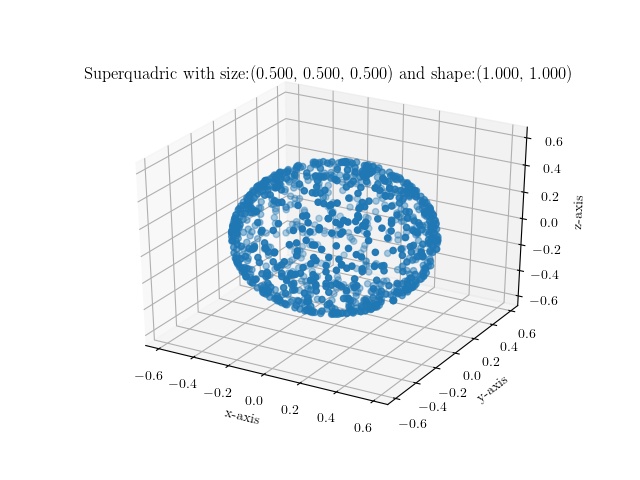
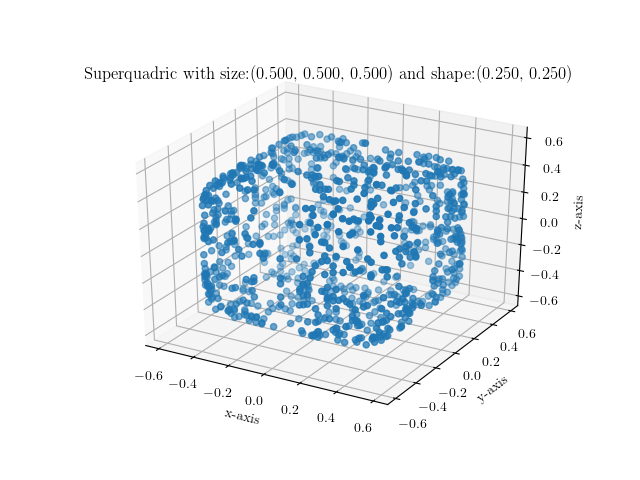
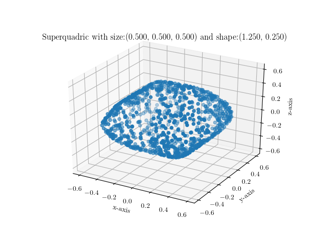

## Superquadrics Revisited: Learning 3D Shape Parsing beyond Cuboids

This repository contains the code that accompanies our CVPR 2019 paper
[Superquadrics Revisited: Learning 3D Shape Parsing beyond Cuboids](https://arxiv.org/pdf/1904.09970.pdf)


Dependencies & Installation
----------------------------

Our library has the following dependencies:

- Python 2.7
- [PyTorch](https://pytorch.org/get-started/locally/)
- torchvision
- numpy
- [scikit-learn](https://scikit-learn.org/stable/install.html)
- [progress](https://pypi.org/project/progress/)
- [pyquaternion](http://kieranwynn.github.io/pyquaternion/)
- [trimesh](https://github.com/mikedh/trimesh)
- Rtree
- [backports.functools_lru_cache](https://pypi.org/project/backports.functools_lru_cache/)
- [Cython](https://cython.readthedocs.io/en/latest/src/quickstart/install.html)
- [sympy](https://pypi.org/project/sympy/)
- seaborn
- matplotlib
- [PIL](https://pillow.readthedocs.io/en/stable/installation.html#basic-installation)
- [mayavi](https://docs.enthought.com/mayavi/mayavi/installation.html#installing-with-pip)

They should be automatically installed by running
```
pip install --user -e .
```

Please note that you might need to install `python-qt4` in order to be able to
use mayavi. You can do that by simply typing
```
sudo apt install python-qt4
```
Now you are ready to start playing with the code!

Evaluation
----------

For evaluating a previously trained model, we provide the `forward_pass.py`
script that allows you to predict and visualize the predicted shape of an object as 
superquadric surfaces using mayavi.

You can run it by simply typing
```
$ ./forward_pass.py ../demo/03001627/ /tmp/ --model_tag "dac4af24e2facd7d3000ca4b04fcd6ac" --n_primitives 18 --weight_file ../config/chair_T26AK2FES_model_699 --train_with_bernoulli --use_deformations --use_sq --dataset_type shapenet_v2
```

The script requires two mandatory arguments, the path to the directory that
contains the dataset `~/data/03001627` and the path to a directory that will be
used for saving the generated files `/tmp`. You should also provide (even if it
is not mandatory) the path to the previously trained model via the
`--weight_file` argument, as well as the tag of the model you want to
reconstruct (`--model_tag`) and the type of the dataset you are using
(`--dataset_type`). Note that you should provide the same arguments that you
used when training the model, regarding the configuration of the geometric
primitives (e.g number of primitives, whether or not to use superquadrics etc.).

If you ran the above command you should see something like:
```
$ ./forward_pass.py ~/data/03001627/ /tmp/ --model_tag "dac4af24e2facd7d3000ca4b04fcd6ac" --n_primitives 18 --weight_file ../config/chair_T26AK2FES_model_699 --train_with_bernoulli --use_deformations --use_sq --dataset_type shapenet_v2
No handlers could be found for logger "trimesh"
Running code on  cpu
Found 6778 'ShapeNetV2' models
1 models in total ...
R: [[-0.38369974  0.57926947  0.7191812 ]
 [-0.5103006   0.5160787  -0.6879362 ]
 [-0.7696545  -0.6309594   0.09758216]]
t: [[-0.01014123]
 [-0.04051362]
 [ 0.00080032]]
e: [1.3734075, 1.3150274]
K: [-0.33036062, 0.23313229]
R: [[-0.5362834   0.04193148 -0.8429957 ]
 [ 0.78693724  0.3859552  -0.4814232 ]
 [ 0.3051718  -0.92156404 -0.23997879]]
t: [[-0.18105912]
 [ 0.11244812]
 [ 0.09697253]]
e: [0.7390462, 1.157957]
...
R: [[ 0.9701394  -0.24186404 -0.01820319]
 [-0.24252652 -0.96831805 -0.059508  ]
 [-0.00323363  0.06214581 -0.99806195]]
t: [[-0.02585344]
 [-0.15909581]
 [-0.091534  ]]
e: [0.4002924, 0.40005013]
K: [0.41454253, 0.3229351]
0 3.581116e-08
1 0.99999857
2 0.99999917
3 3.7113843e-08
4 0.9999982
5 0.9999975
6 0.9999988
7 0.9999999
8 3.5458616e-08
9 3.721507e-08
10 3.711448e-08
11 3.9621053e-08
12 3.7611613e-08
13 0.9999976
14 0.99999905
15 0.9999981
16 0.9999982
17 0.99999785
Using 11 primitives out of 18
```
and a chair should appear.

Training
--------

To train a new network from scratch we provide the `train_network.py` script.

You can simply execute it by typing
```
$ ./train_network.py ~/data/03001627/ /tmp/ --use_sq --lr 1e-4 --n_primitives 20 --train_with_bernoulli --dataset_type shapenet_v2
Running code on  cpu
Save experiment statistics in 26EKQBNTG
Found 6778 'ShapeNetV2' models
6778 models in total ...
1000/1000 [==============================] - 6s 6ms/step
Epoch 1/150 |                                | 15/500 - loss: 0.0110078 - pcl_to_prim: 0.0024909 - prim_to_pcl: 0.0085169 - exp_n_prims: 9.8473

```

You need to specify the path to the directory containing the dataset directory
as well as the path to save the generated files such as the trained models.
Note that the script automatically generates a subfolder inside the specified
output directory (in this case `26EKQBNTG`), where it saves the trained models,
three .txt files with the loss evolution and a .json file with the parameters
used for the current experiment.

Visualizing Superquadrics
-------------------------

We also provide the `visualize_sq.py` script which allows you to quickly
visualize superquadrics given a set of parameters as a set of points sampled on
the surface of the superquadric surface.

You can simply execute it by providing your preferred shape and size parametrization as follows:
```
$ ./visualize_sq.py --shape 1.0,1.0 --size 0.25,0.25,0.25
```
Below are some example images of various superquadrics using different shape
and size parameters





Contribution
------------
Contributions such as bug fixes, bug reports, suggestions etc. are more than
welcome and should be submitted in the form of new issues and/or pull requests
on Github.

License
-------
Our code is released under the MIT license which practically allows anyone to do anything with it.
MIT license found in the LICENSE file.


Relevant Research
------------------
Below we list some papers that are relevant to the provided code.

**Ours:**
- Superquadrics Revisited: Learning 3D Shape Parsing beyond Cuboids [pdf](https://arxiv.org/pdf/1904.09970.pdf) [blog](https://autonomousvision.github.io/superquadrics-revisited/)

**By Others:**
- Learning Shape Abstractions by Assembling Volumetric Primitives [pdf](https://arxiv.org/pdf/1612.00404.pdf)
- 3D-PRNN: Generating Shape Primitives with Recurrent Neural Networks [pdf](https://arxiv.org/abs/1708.01648.pdf)
- Im2Struct: Recovering 3D Shape Structure From a Single RGB Image [pdf](http://openaccess.thecvf.com/content_cvpr_2018/html/Niu_Im2Struct_Recovering_3D_CVPR_2018_paper.pdf)

Below we also list some more papers that are more closely related to superquadrics
- Equal-Distance Sampling of Supercllipse Models [pdf](https://pdfs.semanticscholar.org/3e6f/f812b392f9eb70915b3c16e7bfbd57df379d.pdf)
- Revisiting Superquadric Fitting: A Numerically Stable Formulation [link](https://ieeexplore.ieee.org/document/8128485)


Citation
--------
If you found this work influential or helpful for your research, please consider citing

```
@Inproceedings{Paschalidou2019CVPR,
     title = {Superquadrics Revisited: Learning 3D Shape Parsing beyond Cuboids},
     author = {Paschalidou, Despoina and Ulusoy, Ali Osman and Geiger, Andreas},
     booktitle = {Proceedings IEEE Conf. on Computer Vision and Pattern Recognition (CVPR)},
     year = {2019}
}
```
